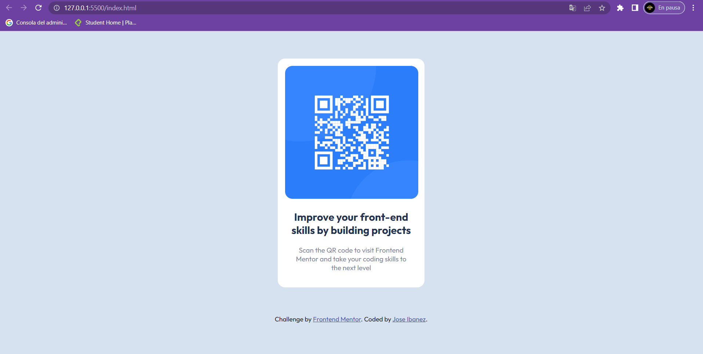

# Frontend Mentor - QR code component solution

This is a solution to the [QR code component challenge on Frontend Mentor](https://www.frontendmentor.io/challenges/qr-code-component-iux_sIO_H). Frontend Mentor challenges help you improve your coding skills by building realistic projects. 

## Table of contents

- [Overview](#overview)
  - [Screenshot](#screenshot)
- [My process](#my-process)
  - [Built with](#built-with)
- [Author](#author)

### Screenshot

## My process

First structure the html by creating a main container for the card and then another container for the image, I preferred to put the image as a background because that way I have more control than using the img tag.

Then in css we shaped the containers, accommodating them according to the requirements and then the h1 and the paragraph, adjusting the margins and padding.

### Built with

- Semantic HTML5 markup
- CSS custom properties

## Author

- Frontend Mentor - [@Ibanezense](https://www.frontendmentor.io/profile/Ibanezense)
- Twitter - [@Josibanezm](https://twitter.com/Josibanezm)

